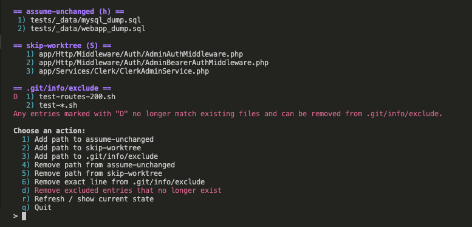

# ignore

`ignore` is a small Bash command for managing patterns in a Git repository's local exclude file (`.git/info/exclude`) and for managing files marked with Git's `assume-unchanged` or `skip-worktree` flags.

You can copy the script directly into a single project directory and run it there if you only want it for that repository. If you want to use `ignore` across all of your Git projects, it is recommended to move it into `~/.local/bin` so it is available globally in your shell.



## How the categories work

### `assume-unchanged (h)`

`assume-unchanged` tells Git to stop checking a tracked file for local modifications during normal status/diff scans. This can be useful for very large generated or vendor files where repeatedly scanning for local changes is expensive and slows down common Git commands.

Use it when you want local performance benefits on files you do not plan to edit often. If you do edit one of these files, Git may not report those changes until you clear the flag, so treat this as a performance hint rather than an ignore rule.

### `skip-worktree (S)`

`skip-worktree` tells Git to prefer the version in the index and generally leave your working copy alone. This is often used for tracked files that developers customize locally (for example, machine-specific config) while avoiding accidental commits of those local edits.

It is stronger than `assume-unchanged` and is intended for "keep my local copy" workflows. If the same file changes upstream, you need to consciously clear the flag and update or restore it, because skip-worktree can hide those changes from your day-to-day Git output.

### `.git/info/exclude`

`.git/info/exclude` is a local ignore file for untracked paths and patterns. It behaves like `.gitignore`, but it is not committed, so rules only apply in your local repository clone.

This is a great place for personal ignore rules, local tooling artifacts, backups like `*.bak`, and machine-specific files you never want to stage. Unlike the two flags above, exclude rules apply to untracked files and pattern matching, not tracked-file index flags.

## Install on macOS to `~/.local/bin`

1. Install the script:

```bash
mkdir -p ~/.local/bin
cp ignore ~/.local/bin/ignore
chmod +x ~/.local/bin/ignore
```

2. Ensure `~/.local/bin` is on your `PATH` (zsh):

```bash
echo 'export PATH="$HOME/.local/bin:$PATH"' >> ~/.zshrc
source ~/.zshrc
```

## Verify installation

Run:

```bash
which ignore
```

It should print:

```text
/Users/<your-user>/.local/bin/ignore
```

## Usage

From inside any Git repository:

```bash
ignore
```

If you run it outside a Git repository, it will exit with:

```text
Not inside a git repository.
```

## Contributing

I would love help testing this command on operating systems and platforms other than macOS. If you try it on Linux, Windows (including WSL), or other environments, please share how it worked for you.

If you find bugs or compatibility issues, pull requests with fixes are very welcome.
